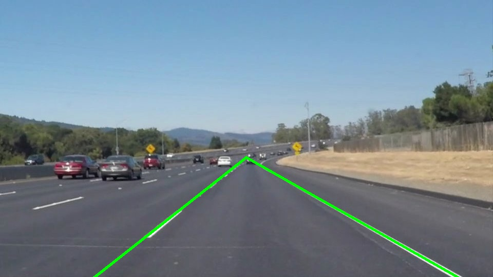
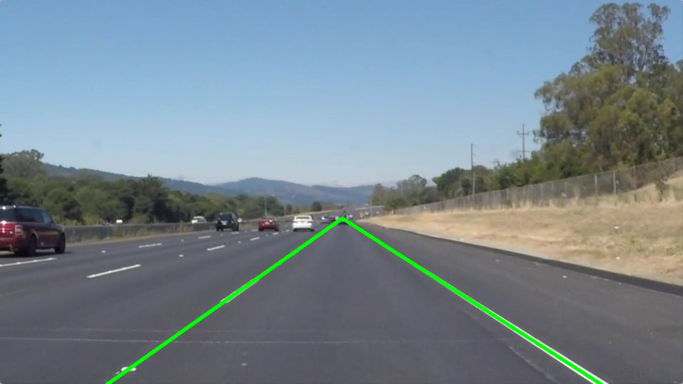
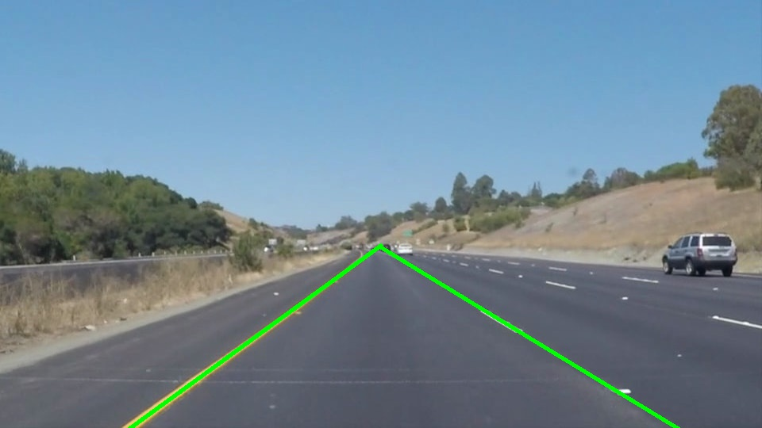
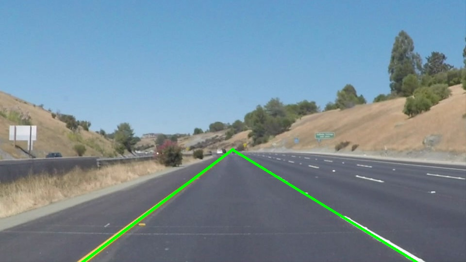
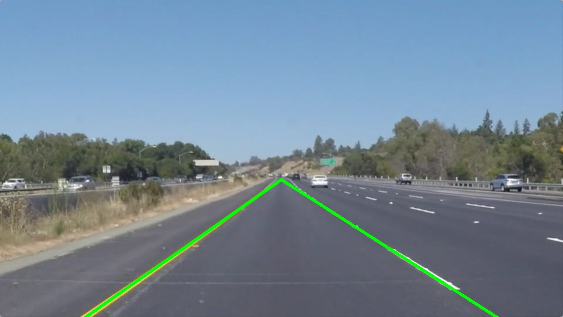
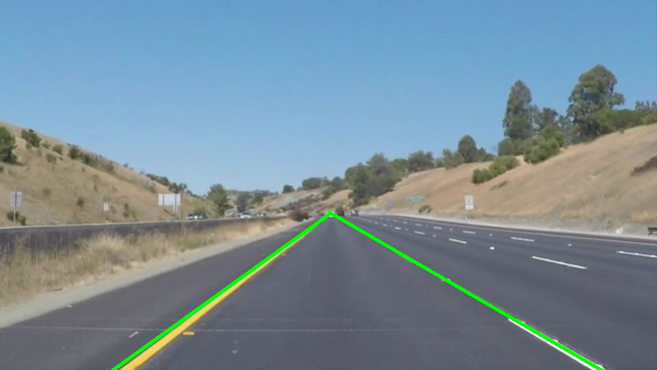

# **Finding Lane Lines on the Road** 

Overview
---

When we drive, we use our eyes to decide where to go.  The lines on the road that show us where the lanes are act as our constant reference for where to steer the vehicle.  Naturally, one of the first things we would like to do in developing a self-driving car is to automatically detect lane lines using an algorithm.

In this project you will detect lane lines in images using Python and OpenCV.  OpenCV means "Open-Source Computer Vision", which is a package that has many useful tools for analyzing images.  

The Project
---

**Step 1:** Install [Anaconda](https://www.anaconda.com/products/individual)

**Step 2:** Install the libraries listed in the requirements.txt

**Step 3:** Open the code in a Jupyter Notebook

Jupyter is an Ipython notebook where you can run blocks of code and see results interactively.  All the code for this project is contained in a Jupyter notebook. To start Jupyter in your browser, use terminal to navigate to your project directory and then run the following command at the terminal prompt:

`> jupyter notebook`

A browser window will appear showing the contents of the current directory.  Click on the file called "P1.ipynb".  Another browser window will appear displaying the notebook.  Follow the instructions in the notebook to complete the project.  

Final Output
---

The program uses a pipeline that I created to find and draw the lane lines unto the inputted image

Here is the image transformation of the pipeline:

Input             |  Output
:-------------------------:|:-------------------------:
  |  
  |  
  |  
  |  
  |  
  |  